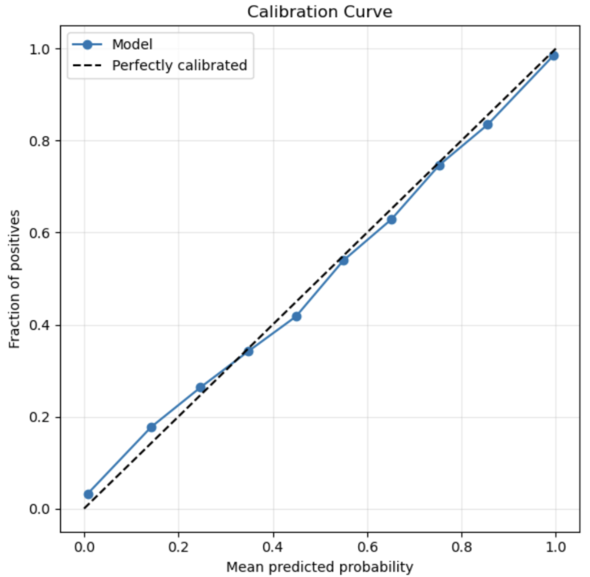
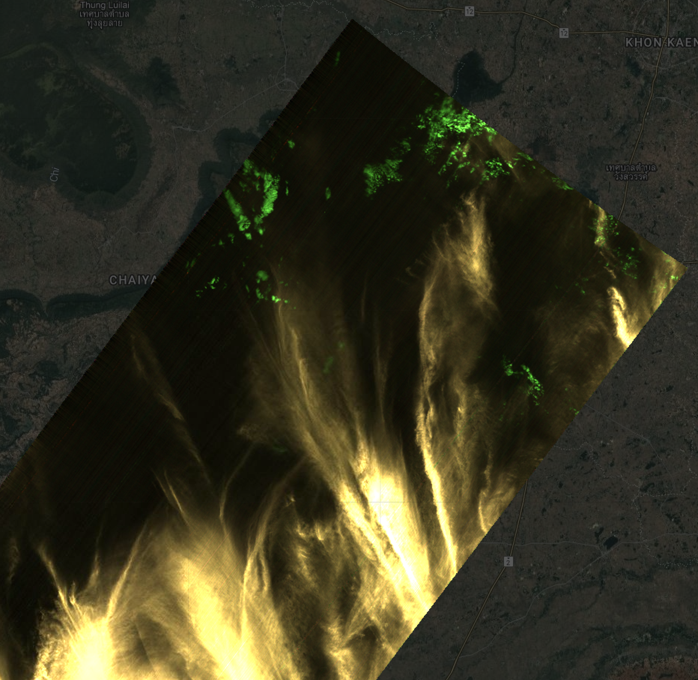
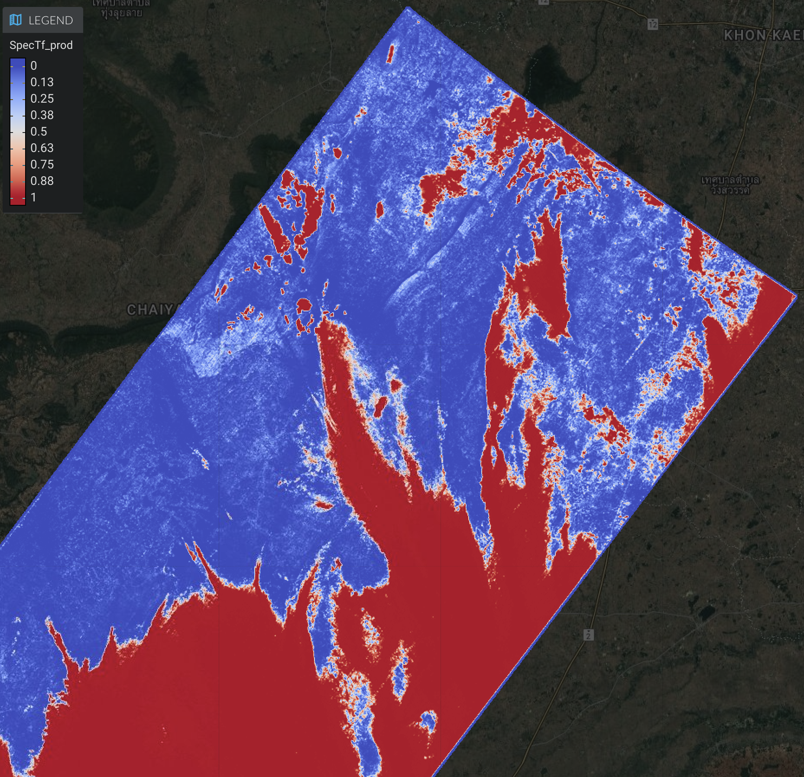
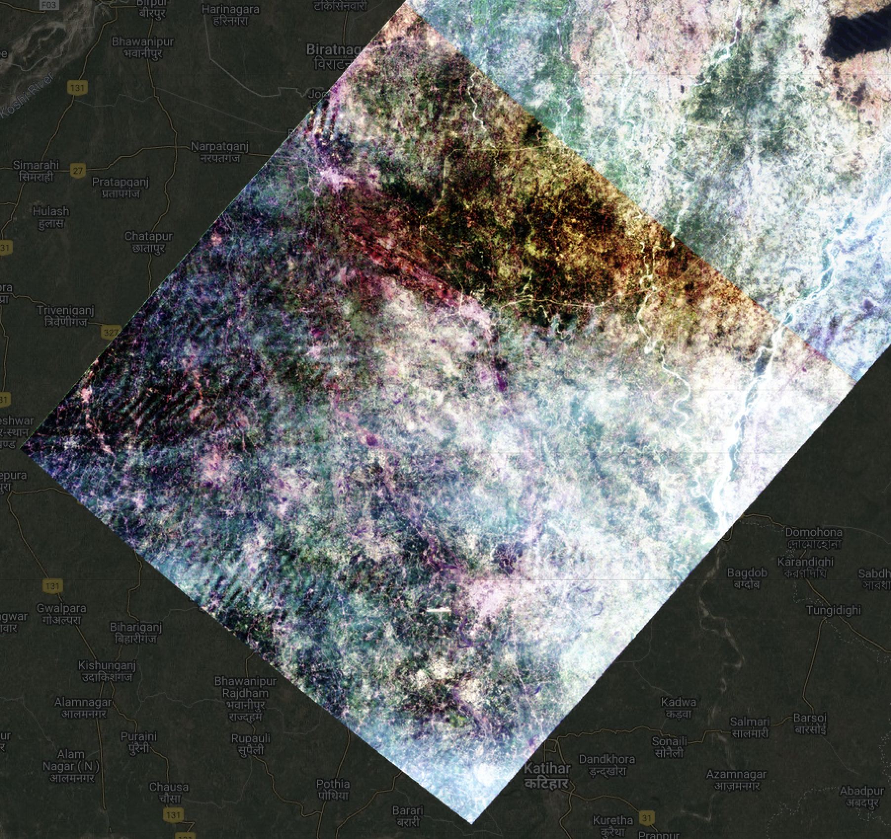
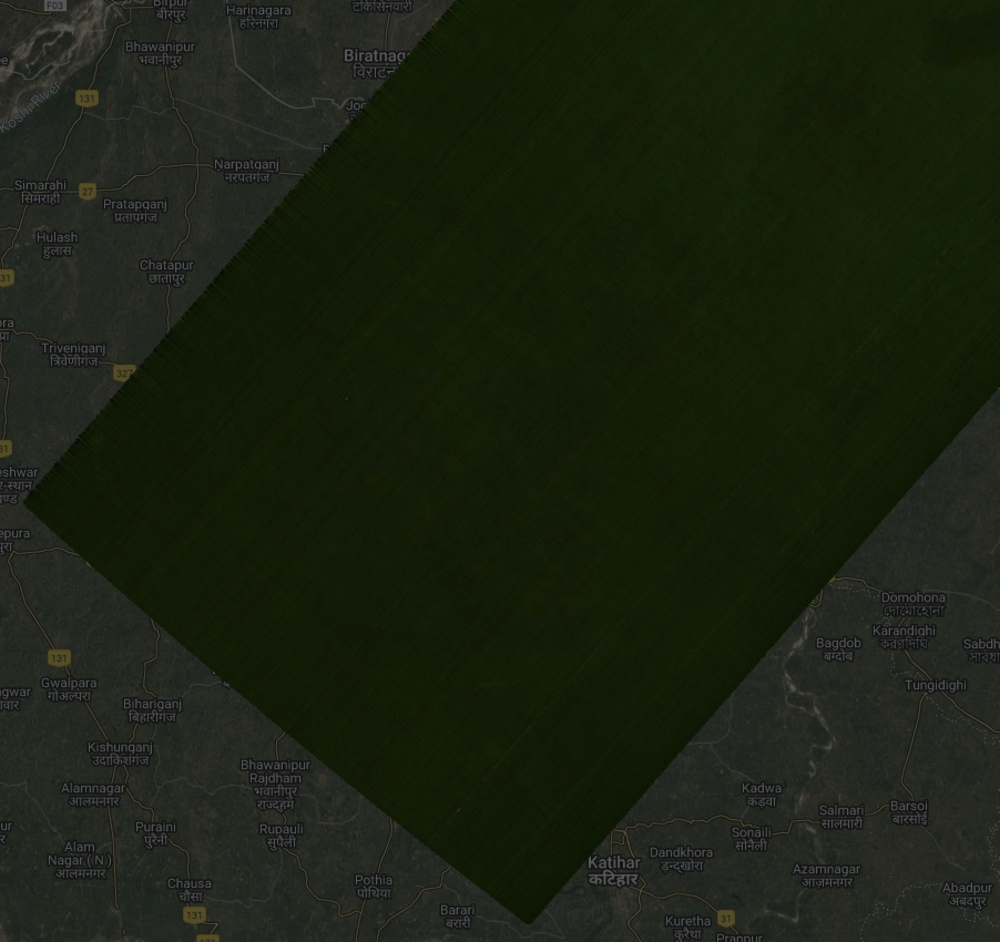
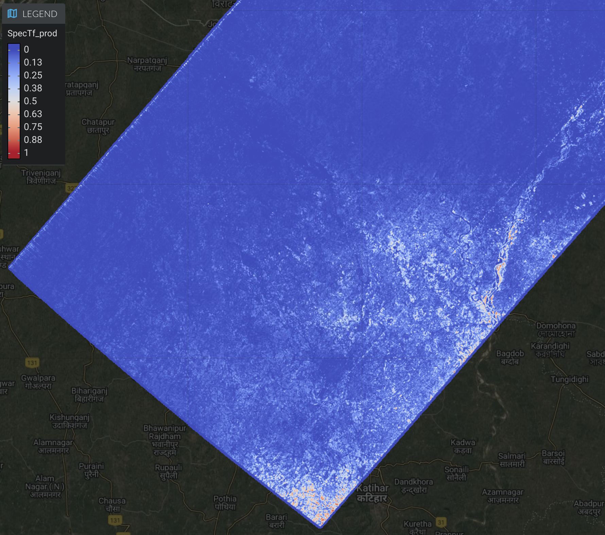
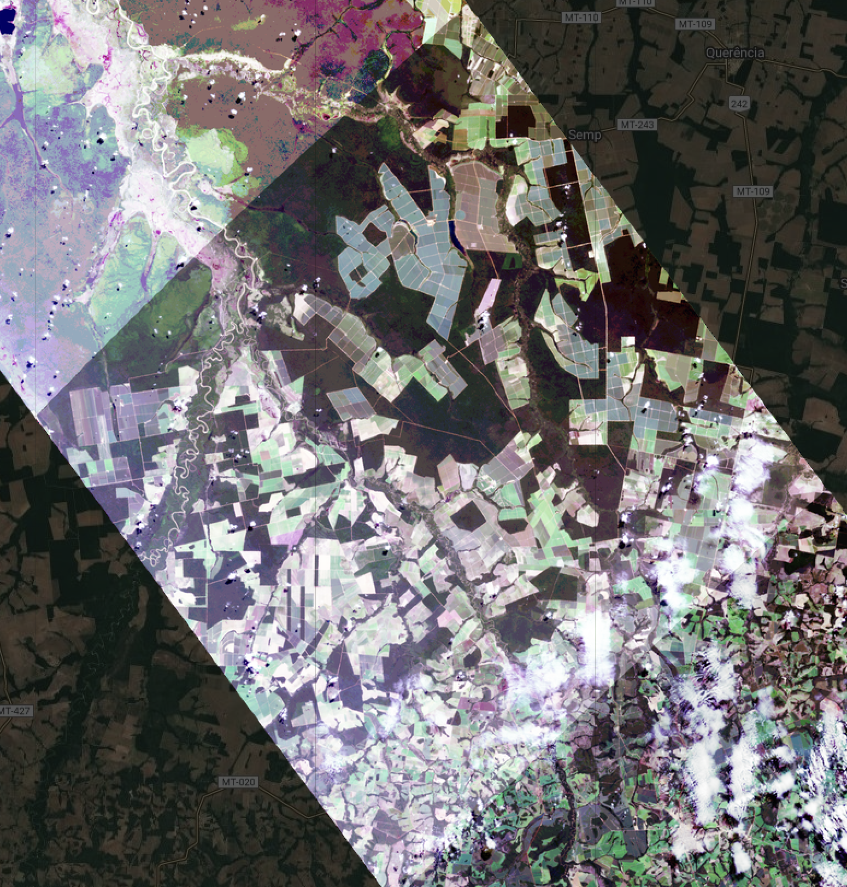
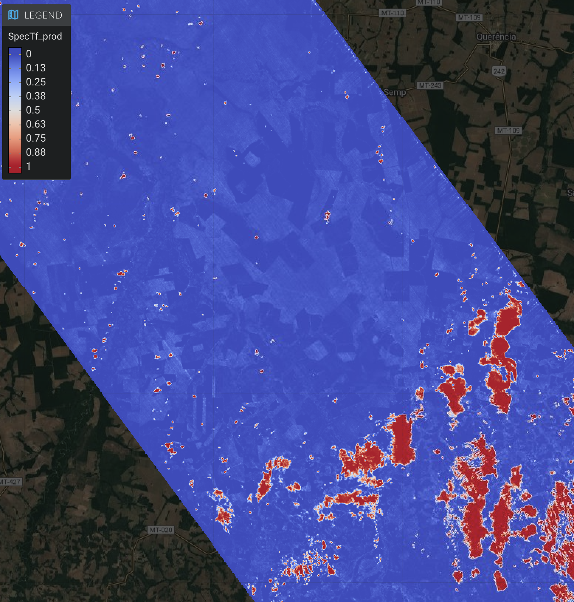

# **Earth Surface Mineral dust source InvesTigation (EMIT)** 

## EMIT L2A Algorithm: Mask 

*Philip G. Brodrick*1
*Jake H. Lee*1
*Michael Kiper*1
*Winston Olson-Duvall*1
*Sarah R. Lundeen*1

1Jet Propulsion Laboratory, California Institute of Technology

**Version:** 0.1  
**Release Date:** TBD  
**JPL- D-XXXXXX**  

Jet Propulsion Laboratory
California Institute of Technology
Pasadena, California 91109

**Change Log**
| Version | Date       | Comments |
|---------|------------|----------|
| 0.0     | 2025-09-09 | Initial Draft |
| 0.1     | 2025-12-02 | Cleanup for initial V002 release |

**Product Release History**

V02 - The first release of the EMIT L2A Mask product is labeled as a V02 product.  This is 
because the mask was originally included as part of the L2A Reflectance data product. Starting
in V02, the mask is being produced as a separate L2A product in order to facilitate
updates that are independent of updates to reflectance processing.  V02 includes
all of the same bands as the V01 product, along with 3 new bands for cloud
masking based on SpecTf, a deep learning model for cloud detection detailed below.  The V02 product also fixes an issue with the nodata values in the V01 product, setting all values
where the onboard cloudscreening was flagged (and no data downlinked) to -9999.

## Table of Contents
- [1. Key Teammembers](#1-key-teammembers)
- [2. Historical Context and Background on the EMIT Mission and its Instrumentation](#2-historical-context-and-background-on-the-emit-mission-and-its-instrumentation)
- [3. Algorithm Rationale](#3-algorithm-rationale)
- [4. Algorithm Implementation](#4-algorithm-implementation)
  - [4.1 Input Data](#41-input-data)
  - [4.2 Theoretical Description](#42-theoretical-description)
    - [4.2.1 SpecTf](#421-spectf)
    - [4.2.3 Cloud Buffer](#423-cloud-buffer)
  - [4.3 Practical Considerations](#43-practical-considerations)
  - [4.4 Output Data](#44-output-data)
- [5. Calibration, uncertainty characterization and propagation, and validation](#5-calibration-uncertainty-characterization-and-propagation-and-validation)
- [6. Constraints and Limitations](#6-constraints-and-limitations)
- [References](#references)

## **1. Key Teammembers**

Philip G. Brodrick (Jet Propulsion Laboratory)
David R. Thompson (Jet Propulsion Laboratory)
Robert O. Green (Jet Propulsion Laboratory)
Jake H. Lee (Jet Propulsion Laboratory)
Michael Kiper (Jet Propulsion Laboratory)
Winston Olson-Duvall (Jet Propulsion Laboratory)
Sarah R. Lundeen (Jet Propulsion Laboratory)

The EMIT Science and Applications team played a critical role in testing and evaluating
iterations of the algorithms described below.

## **2. Historical Context and Background on the EMIT Mission and its Instrumentation**

Mineral dust aerosols originate as soil particles lifted into the atmosphere by wind erosion. Mineral dust created by
human activity makes a large contribution to the uncertainty of direct radiative forcing (RF) by anthropogenic aerosols 
(USGCRP and IPCC) and is a prominent aerosol constituent around the globe. However, we have poor understanding 
of its direct radiative effect, partly due to uncertainties in the dust mineral composition. Dust radiative forcing is 
highly dependent on its mineral-specific absorption properties. The current range of iron oxide abundance in dust source 
models translates into a large range of values, even changing the sign of the forcing (-0.15 to 0.21 W/m2) predicted by 
Earth System Models (ESMs) (Li et al., 2020). The National Aeronautics and Space Administration (NASA) selected the 
Earth Surface Mineral Dust Source Investigation (EMIT) to close this knowledge gap. NASA launched an instrument to the 
International Space Station (ISS) to directly measure and map the soil mineral composition of critical dust-forming 
regions worldwide.

## **3. Algorithm Rationale**

Masking clouds is a perennial challenge in remote sensing with a long history
of algorithmic approaches. The EMIT L2A cloud mask uses thresholds on 420 nm, 
1250 nm, and 1650 nm to mask clouds, a threshold on 1380 nm to mask cirrus clouds, 
and dilates these masks to avoid cast shadows (L2A ATBD Section 4.2.5). While
efficient, this method results in false positive detections above bright surface
features (e.g. desert and snow) and false negative detections for lower, darker
clouds and optically translucent clouds (e.g. cirrus).

More recent work has proposed deep learning methods for cloud detection
for multispectral instruments. These methods rely on learning spatial or temporal
context for detection; however, clouds rarely maintain a consistent morphology,
and temporal methods require a consistent time sequence that is not always available.

EMIT leverages its spectral fidelity through the use of SpecTf, a deep learning model developed 
specifically to learn
spectral features for imaging spectroscopy tasks (Lee et al., 2025). By learning
from millions of globally diverse hand-labeled examples of clear and cloudy pixels,
SpecTf learns to produce a robust and accurate cloud mask. In particular, we produce a
cloud mask that is as sensitive to even the thinnest of clouds in order to benefit
downstream reflectance analyses that could be negatively impacted by such distortions.

## **4. Algorithm Implementation**

### **4.1 Input Data**

The EMIT input and output data products delivered to the DAAC use their formatting conventions,
the system operates internally on data products stored as binary data cubes with detached human-
readable ASCII header files. The precise formatting convention adheres to the ENVI standard,
accessible (Jan 2020) at https://www.harrisgeospatial.com/docs/ENVIHeaderFiles.html. The
header files all consist of data fields in equals-sign-separated pairs, and describe the layout of the
file. The specific input files needed for the L2b stage are:

1. A **radiance-at-sensor** data file typically with the string "rdn" in the filename, in units of uW/cm2/nm/sr.
The data is in the instrument frame (non-orthorectified) representation with
size [rows x cols x channels] in single-precision floating point representation. There are 285 channels.
2. An **observation** file, typically with the string "obs" in the filename,
contains information about the observation geometry for every pixel. The observation
file uses the original instrument frame (non-orthorectified) coordinate system with
size [rows x cols x 12] in single-precision floating point representation. It should overlay the radiance data 
exactly so that all of the pixels are associated between the two files. The channels contain:
    1. Path length - the direct geometric distance from the sensor to the location on the surface of the Earth, as defined by a Digital Elevation Model (DEM)
    2. To-sensor azimuth, in decimal degrees, at the surface
    3. To-sensor zenith, in decimal degrees, at the surface
    4. To-sun azimuth, in decimal degrees, at the surface
    5. To-sun zenith, in decimal degrees, at the surface
    6. Phase angle in degrees, representing the angular difference between incident and observation rays
    7. Terrain slope in degrees as determined from DEMs
    8. Terrain aspect in degrees, as determined from DEMs
    9. The cosine of the solar incidence angle relative to the surface normal
    10. UTC time
3. A **location** file, typically with the string "loc" in the filename, contains information about the specific location of each pixel.  The location file uses the original instrument frame (non-orthorectified) coordinate system with size [rows x cols x 3] in double-precision floating point representation.  The channels contain:
    1. Latitude in decimal degrees
    2. Longitude in decimal degrees
    3. Elevation in meters above mean sea level
4. A **geolocation lookup table** (LUT) file, typically with the string "glt" in the filename, contains information to map each pixel from the original instrument frame (non-orthorectified) coordinate system to a georeferenced Universal Transverse Mercator (UTM) coordinate system.  The geolocation lookup table is orthorectified in EPSG:4326 (latitude / longitude), and provides the x,y coordinates for the raw-frame data in each location, in integer representation.  The channels contain:
    1. x-pixel location
    2. y-pixel location
5. An **atmospheric** file, which contains the interpolated atmpospheric water vapor and aerosol optical depth with size [rows x cols x N] in single-precision floating point representation.  Only two of these channels will be used, but more may be present.
    1. Water vapor in gm / cm2
    2. Aerosol optical depth at 550 nm

"Bad data" at the periphery outside the field of view, or masked as a result of 
onboard cloud masking or instrument error, is assigned the reserved (floating point) 
NODATA value -9999 within the radiance dataset. 
In addition to these files above, which change on a per acquisition basis, 
the L2B mask uses a wide range of ancillary files in its configuration. 
These include model architecture configuration files, model weight binaries, and more. These
ancillary files are outside the scope of this ATBD, where we will concern ourselves with the
data associated with a particular product and acquisition. We will also disregard internal
configurations used by the science data system for managing and running these processes.

### **4.2 Theoretical Description**

The goal of the EMIT mask file is to provide information relevant for choosing which pixels to use in different analyses.  Different bands correspond to different relevant information, including information on atmospheric conditions, cloud cover, surface water, and more. The V02 mask extends the V01 product, retaining all of the same bands but adding three additional ones.

There are three main sets of information included - the original cloud masks (bands), interpolated atmospheric data from 
the L2A surface and atmospheric modeling step, and a new cloud mask based on SpecTf, a deep learning model for cloud detection. 

The general philosophy of this file is to provide information useful in screening out pixels for different downstream
analysis.  The level of detail - and in sometimes redundant estimates of the same property - are there to maximize
the utility for different objectives.

#### 4.2.1 SpecTf

##### Training Data

The foundation of a robust data-driven model is laid with high-quality training data.
Experts hand-labeled cloudy and clear regions in 990 EMIT scenes while referencing
RGB quicklooks, cloud-enhancing falsecolors, and previous models' false predictions.
7.1 million Top-of-Atmosphere (TOA) reflectance spectra from these labels used to 
train and validate the cloud mask model are archived at:
https://doi.org/10.5281/zenodo.15833303

An effort was made during annotation to include any and all instances of cloud cover.
This included clouds visible in either the RGB quicklook or the falsecolor (or both),
and all degrees of translucency. This resulted in a model that is very sensitive
to any presence of a cloud in each pixel. 

##### Model

SpecTf is a small model based on the transformer encoder architecture. Given
a sequence representing the TOA reflectance spectra of each pixel, the model 
predicts the probability that a cloud is present. Please refer to Lee et al. 2025 
for a complete technical description. This model is applied pixelwise
to the entire scene to generate a probability map of values in the range [0,1], 
where 1 indicates cloud presence. 

This probability map is thresholded at >0.51 to produce a binary mask of 0s and 1s.
This threshold is determined by optimizing the model's F1-score performance metric on a
dataset held-out during model training. The F1-score is the harmonic mean of precision
and recall; a higher threshold would improve precision while worsening recall, and
vice versa. To accommodate downstream tasks that may have different cloud sensitivity
requirements, we deliver the probability map itself to be thresholded at any value.

The output probability does not correlate with cloud translucency. That is, increasing
the threshold will not exclude more translucent clouds while retaining more opaque clouds.
Rather, the output probability correlates with the model's confidence in its output, and
uncertainty may be due to characteristics of the spectra or representation in the training
dataset. 

#### 4.2.3 Cloud Buffer

A simple cloud buffer is applied to the binary mask in order to offer the user the ability
to extend the buffer in any direction. For convenience, the buffer shows the number of pixels
from the nearest identified cloud pixel, allowing the user to threshold at various distances.
This allows the buffer to variably be used to capture 3D cloud effects or cloud shadows, although
for cloud shadows the buffer will be overly conservative since it is omnidirectional.  The buffer
extends up to the number of pixels that would be required to mask a 4 km cloud with the observation
geometry specific to the scene (see [make_emit_masks.py](../make_emit_masks.py)).

### **4.3 Practical Considerations**

Due to the high sensitivity of this model to cloud presence, this mask may not be
appropriate for downstream tasks that are robust to some presence of translucent
or optically clear cirrus clouds. Comparison with the L2A cloud and cirrus masks may
be useful to determine whether a more sensitive cloud mask is helpful.

### **4.4 Output Data**

The EMIT output data products delivered to the DAAC use their formatting conventions, the
system operates internally on data products stored as binary data cubes with detached human-
readable ASCII header files. The precise formatting convention adheres to the ENVI standard,
accessible (Jan 2020) at https://www.harrisgeospatial.com/docs/ENVIHeaderFiles.html. The
header files all consist of data fields in equals-sign-separated pairs, and describe the layout of the
file. The specific output files from the L2B Mask stage are:

1. A **cloud mask file**, typically with the string l2a_mask in the filename, containing
channels with the following information:
    1. Cloud Flag
    2. Cirrus Flag
    3. Water Flag
    4. Spacecraft Flag
    5. Dilated Cloud Flag
    6. AOD550
    7. H2O (g cm-2)
    8. Aggregate Flag
    9. SpecTf-Cloud Probability
    10. SpecTf-Cloud Flag
    11. SpecTf-Buffer Distance

Any file can contain "bad data" as a result of onboard cloud masking or instrument error.
These pixels are typically assigned the reserved (floating point) value -9999.

## **5. Calibration, uncertainty characterization and propagation, and validation**

The SpecTf model outputs are the only outputs with an estimate of uncertainty.
For these SpecTf predictions, we quantify uncertainty directly from the model's posterior class probabilities. Given the calibration curve on our [test set](https://zenodo.org/records/15833303/files/test_fids.csv) provided below, the model is near-perfectly calibrated given how close it is to a perfect linear fit. This means that the posterior probabilities reliably approximate the likelihood that a given spectra is of a specific class. Roughly, a given probability score will only be between an overconfidence of 2.2% or underconfidence of 1.5%. 

Thus, when interpreting the output probabilities, one can reliably infer that $f(x) ≈ P(class=c|x)$ where $f(•)$ is the model. 

## **6. Constraints and Limitations**
Given that this is a deep learning model trained on a (relatively) small, sparse set of imperfect human labels, it is bound to be an imperfect classifier. Specifically, as a quantitative measure, the model will provide an incorrect label when using the probably threshold of 0.51 about 4% of the time, using the labeled test set as ground truth. Some spectra types have been observed to be more difficult than others for our model to classify properly. Namely, these tend to be: 
- [Figure 1](#fig-1). Scenes where there is a very fine haze. 
- [Figure 2](#fig-2). Regions in India and the South Asian subcontinent that are high in vegetation and aerosols. 
- [Figure 3](#fig-3). Pixel regions that intersect with the known artifact on the slit and instrument artifacts towards the focal plane array on the right edge. 
- [Figure 4](#fig-4). The model also exhibits higher entropy over bright plains and very dense, dark vegetative regions that don't have any cloud trace. 
    - These values tend to be below the 0.51 probability threshold, though, but should be considered nonetheless.

The below figures are examples of the above described challenge regions, with the RGB and False Color (1380, 1420, and 1890 nm bands) to show the true cloud presence distribution compared to the output SpecTf results.

### Figure 1: Thin‑haze scene, emit20240201t033628
| RGB | False Color | SpecTf |
|-----|-------------|--------|
|  |  |  |

### Figure 2: Vegetated & aerosol‑rich scene in India, emit20240201t051259
| RGB | False Color | SpecTf |
|-----|-------------|--------|
|  |  |  |

### Figure 3: Instrument artifact, emit20240301t172047
| RGB | False Color | SpecTf |
|-----|-------------|--------|
|  |  |  |

### Figure 4: Dark, dense vegetation scene, emit20240501t135834
| RGB | False Color | SpecTf |
|-----|-------------|--------|
|  |  |  |

Additionally, when interpreting the results of the model's posterior probabilites, it is important to know that the outputs are the likelihoods of if there is or is not a cloud within the pixel space. This is due to the fact that the model was trained on discrete, exclusive class labels. It is not a measure of how much cloud trace there is within the pixel space. I.e. $P(Cloud)=0.10$ means there is a $10$% chance that the pixel is a cloud pixel, not that $10$% of the measured relfectance is a cloud residual or from a cloud-class source.   

## **References**

J.H. Lee, M. Kiper, D.R. Thompson, and P.G. Brodrick, SpecTf: Transformers enable data-driven imaging spectroscopy cloud detection, Proc. Natl. Acad. Sci. U.S.A. 122 (27) e2502903122, https://doi.org/10.1073/pnas.2502903122 (2025).

L. Li, N.M. Mahowald, R.L. Miller, C. Pérez García-Pando, M. Klose, D.S. Hamilton, M. Gonçalves Ageitos, P. Ginoux, Y. Balkanski, R.O. Green, O. Kalashnikova, J.F. Kok, V. Obiso, D. Paynter, and D.R. Thompson: Quantifying the range of the dust direct radiative effect due to source mineralogy uncertainty, Atmos. Chem. Phys., 21, 3973-4005, https://doi.org/10.5194/acp-21-3973-2021 (2021).