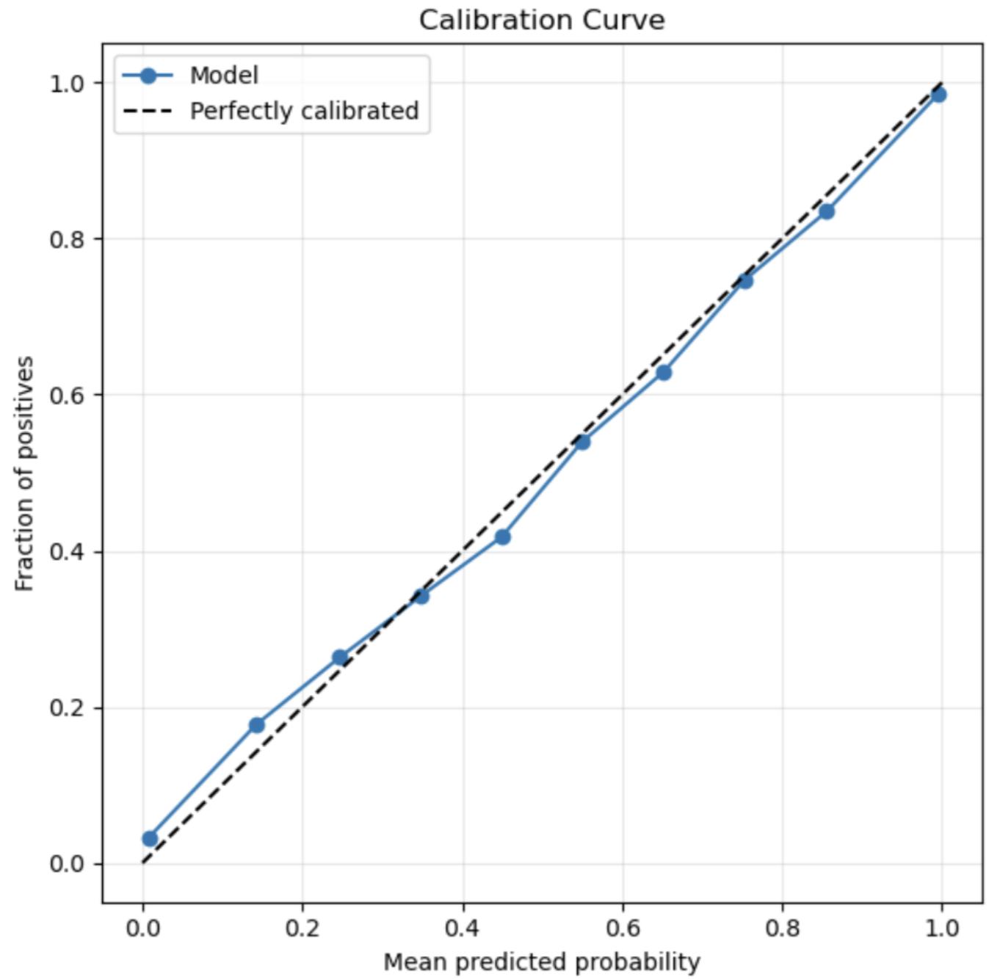

## **Earth Surface Mineral dust source InvesTigation (EMIT)** 

# **EMIT L2B Algorithm: Masks** 

**Philip G. Brodrick**1 
**Jake H. Lee**1 
**Michael Kiper**1 
**Winston Olson-Duvall**1 
**Sarah R. Lundeen**1 

1Jet Propulsion Laboratory, California Institute of Technology

**Version:** 1.0  
**Release Date:** TBD  
**JPL- D-XXXXXX**  

Jet Propulsion Laboratory  
California Institute of Technology  
Pasadena, California 91109-8099  

**Change Log**
| Version | Date       | Comments |
|---------|------------|----------|
| 0.0     | YYYY-MM-DD | Initial Draft |

## **1. Key Teammembers**

## **2. Historical Context and Background on the EMIT Mission and its Instrumentation**

## **3. Algorithm Rationale**

## **4. Algorithm Implementation**

### **4.1 Input Data**

### **4.2 Theoretical Description**

### **4.3 Practical Considerations**

### **4.4 Output Data**

## **5. Calibration, uncertainty characterization and propagation, and validation**
As a measure of uncertainty, the model's posterior probabilities will be used. Looking at the calibration curve on our test set in the provided below, the model is near-perfectly calibrated given how close it is to a perfect linear fit. This means that the posterior probabilities reliably approximate the likelihood that a given spectra is of a specific class. Roughly, a given probability score will only be between an overconfidence of 2.2% or underconfidence of 1.5%. 

## **6. Constraints and Limitations**
Given that this is a deep learning model trained on a (relatively) small, sparse set of imperfect human labels, it is bound to be an imperfect classifier. Specifically, as a quantitative measure, the model will provide an incorrect label when using the $P(0.51)$ threshold about 4% of the time, using the labeled test set as ground truth. Some spectra types have been observed to be more difficult than others for our model to classify properly. Namely, these tend to be: 
- Scenes where there is a very fine haze.
- Regions in India and the South Asian subcontinent that are high in vegetation and aerosols.
- Speck of dust, and focal plane edge instrument residuals. (> [!NOTE] need to provide proper name)
- The model also exhibits higher entropy over bright plains and very dense, dark vegetative regions that don't have any cloud trace. 
    - These values tend to be below the $P(0.51)$ threshold, though, but nonetheless something to look out for.

## **References**

