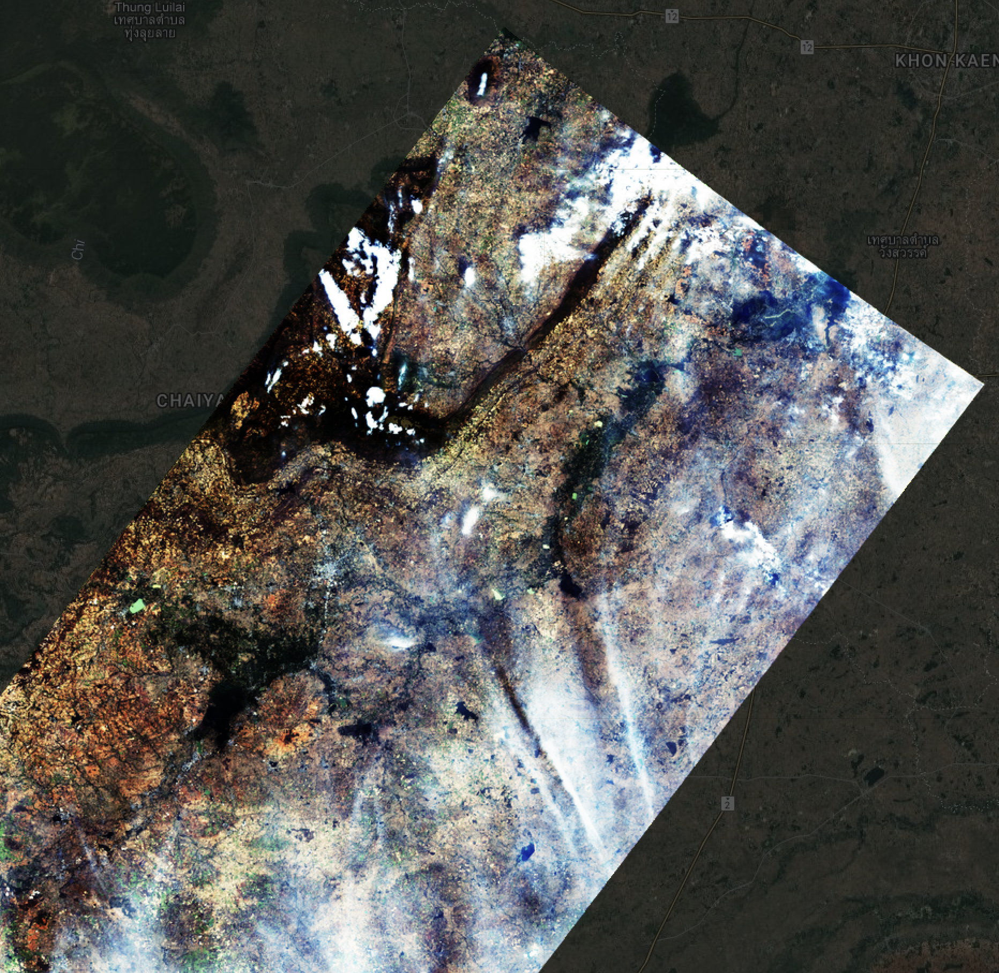
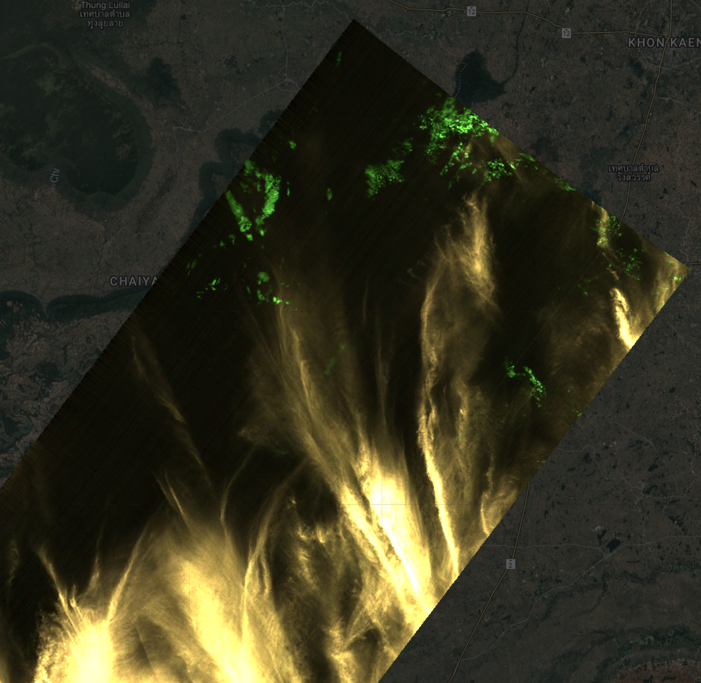
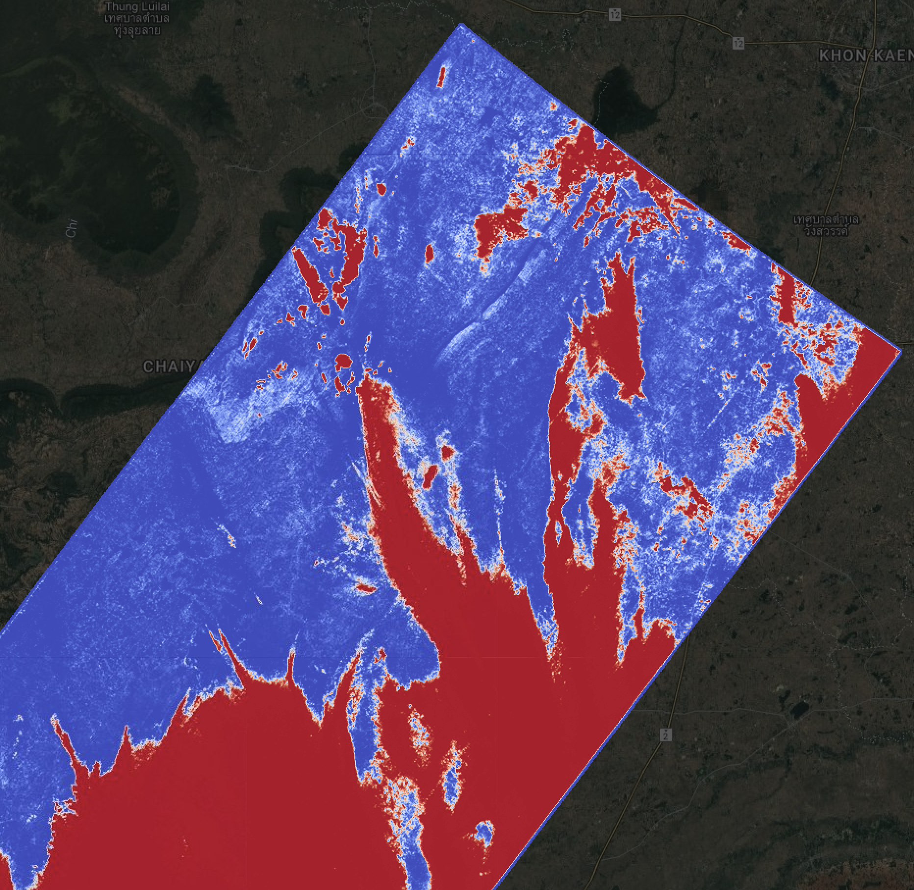
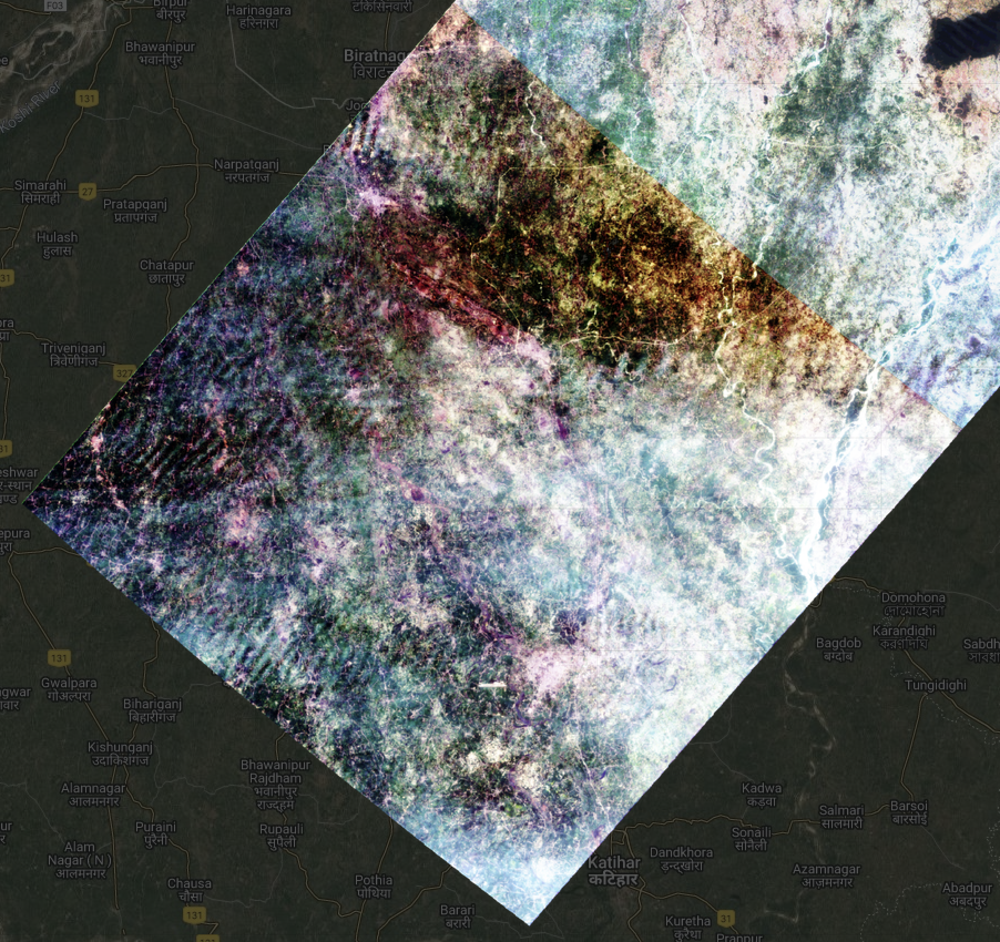
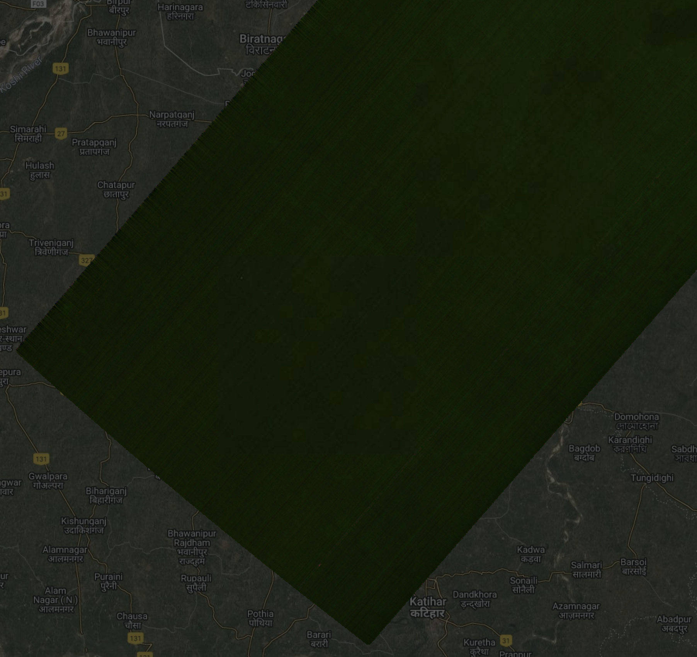
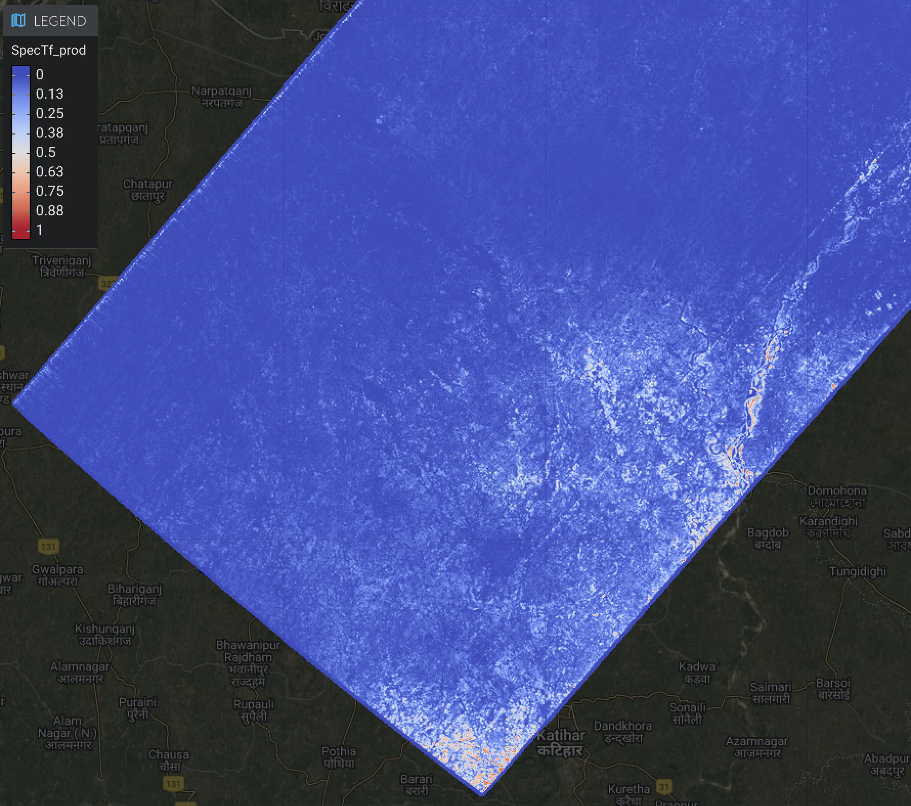
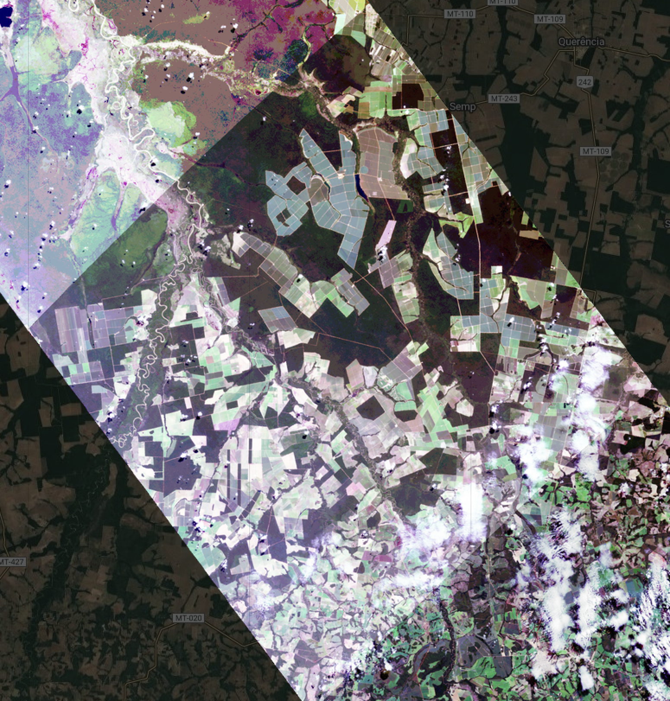
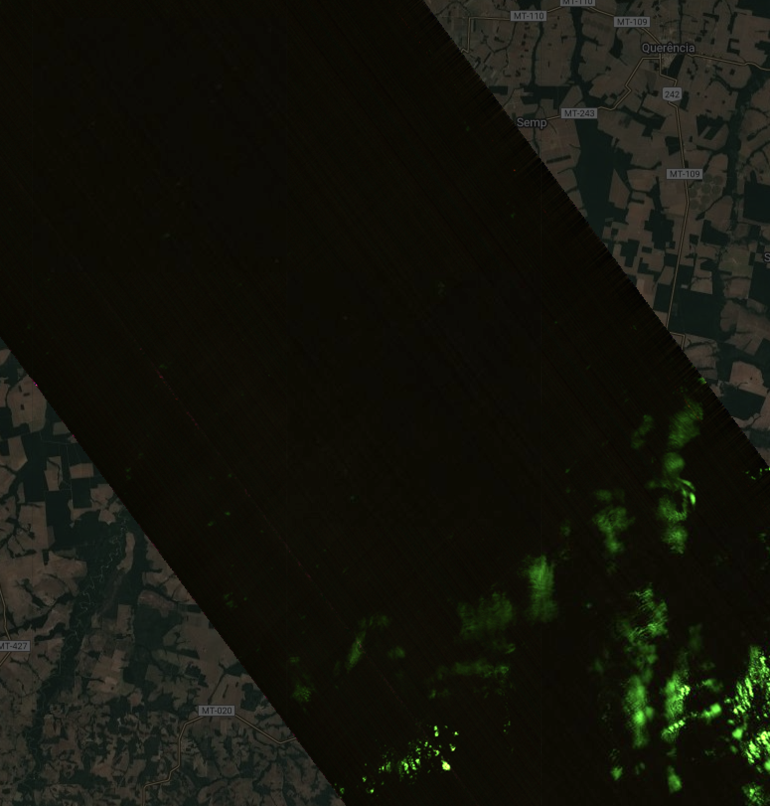
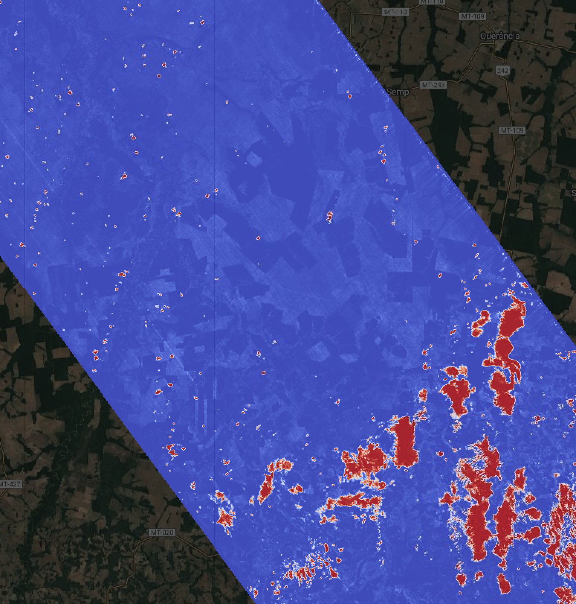

## **Earth Surface Mineral dust source InvesTigation (EMIT)** 

# **EMIT L2B Algorithm: Masks** 

**Philip G. Brodrick**1 
**Jake H. Lee**1 
**Michael Kiper**1 
**Winston Olson-Duvall**1 
**Sarah R. Lundeen**1 

1Jet Propulsion Laboratory, California Institute of Technology

**Version:** 1.0  
**Release Date:** TBD  
**JPL- D-XXXXXX**  

Jet Propulsion Laboratory  
California Institute of Technology  
Pasadena, California 91109-8099  

**Change Log**
| Version | Date       | Comments |
|---------|------------|----------|
| 0.0     | YYYY-MM-DD | Initial Draft |

## **1. Key Teammembers**

## **2. Historical Context and Background on the EMIT Mission and its Instrumentation**

## **3. Algorithm Rationale**

Masking clouds is a perennial challenge in remote sensing with a long history
of algorithmic approaches. The EMIT L2A cloud mask uses thresholds on 420 nm, 
1250 nm, and 1650 nm to mask clouds, a threshold on 1380 nm to mask cirrus clouds, 
and dilates these masks to avoid cast shadows (L2A ATBD Section 4.2.5). While
efficient, this method results in false positive detections above bright surface
features (e.g. desert and snow) and false negative detections for lower, darker
clouds and optically translucent clouds (e.g. cirrus).

More recent works have proposed deep learning methodologies for cloud detection
for multispectral instruments. These methods rely on learning spatial or temporal
context for detection; however, clouds rarely maintain a consistent morphology,
and temporal methods require a consistent time sequence that is not always available.

Instead, EMIT uses SpecTf, a deep learning model developed specifically to learn
spectral features for imaging spectroscopy tasks (Lee et al., 2025). By learning
from millions of globally diverse hand-labeled examples of clear and cloudy pixels,
SpecTf learns to produce a robust and accurate cloud mask. In particular, we produce a
cloud mask that is as sensitive to even the thinnest of clouds in order to benefit
downstream reflectance analyses that could be negatively impacted by such distortions.

## **4. Algorithm Implementation**

### **4.1 Input Data**

[//]: # (Section below copied from L2A ATBD)

The EMIT input and output data products delivered to the DAAC use their formatting conventions,
the system operates internally on data products stored as binary data cubes with detached human-
readable ASCII header files. The precise formatting convention adheres to the ENVI standard,
accessible (Jan 2020) at https://www.harrisgeospatial.com/docs/ENVIHeaderFiles.html. The
header files all consist of data fields in equals-sign-separated pairs, and describe the layout of the
file. The specific input files needed for the L2b stage are:

1. An **observation metadata file**, typically with the string "obs" in the filename, 
contains information about the observation geometry for every pixel. The observation 
file uses the original instrument frame (non-orthorectified) coordinate system with 
size [rows x cols x 12] in Band-Interleaved by Line (BIL) format and single-precision 
IEEE little-endian floating point representation. It should overlay the radiance data 
exactly so that all of the pixels are associated between the two files. The channels contain:
    1. Path length - the direct geometric distance from the sensor to the location on the surface of the Earth, as defined by a Digital Elevation Model (DEM)
    2. To-sensor azimuth, in decimal degrees, at the surface
    3. To-sensor zenith, in decimal degrees, at the surface
    4. To-sun azimuth, in decimal degrees, at the surface
    5. To-sun zenith, in decimal degrees, at the surface
    6. Phase angle in degrees, representing the angular difference between incident and observation rays
    7. Terrain slope in degrees as determined from DEMs
    8. Terrain aspect in degrees, as determined from DEMs
    9. The cosine of the solar incidence angle relative to the surface normal
    10. UTC time
2. Radiance data at sensor, typically with the string "rdn" in the filename, in units of uW/cm2/nm/sr.
The data is in the instrument frame (non-orthorectified) representation with
size [rows x cols x channels] in Band-Interleaved by Line (BIL) format and single-
precision IEEE little-endian floating point representation. There are 285 channels.

"Bad data" at the periphery outside the field of view, or masked as a result of 
onboard cloud masking or instrument error, is assigned the reserved (floating point) 
NODATA value -9999. In addition to these files above, which change on a per acquisition basis, 
the L2B mask stage uses a wide range of ancillary files in its configuration. 
These include model architecture configuration files, model weight binaries, and more. These
ancillary files are outside the scope of this ATBD, where we will concern ourselves with the
data associated with a particular product and acquisition. We will also disregard internal
configurations used by the science data system for managing and running these processes.

| Input file | Format | Interpretation |
| --- | --- | --- |
| Observation Metadata | rows x columns x 12, BIL interleave 32-bit floating point with detached ASCII header | Varies (see text) |
| Radiance Data | rows x columns x channels, BIL interleave 32-bit floating point with detached ASCII header | Radiance at sensor in uW/cm2/nm/sr. |

### **4.2 Theoretical Description**

The goal of this EMIT cloud mask is to provide a highly sensitive cloud mask for
sensitive reflectance analyses. To this end, we train SpecTf, a deep learning model
specialized for spectroscopy, on a large corpus of hand-labeled data.

#### 4.2.1 Training Data

The foundation of a robust data-driven model is laid with high-quality training data.
Experts hand-labeled cloudy and clear regions in 990 EMIT scenes while referencing
RGB quicklooks, cloud-enhancing falsecolors, and previous models' false predictions.
7.1 million Top-of-Atmosphere (TOA) reflectance spectra from these labels used to 
train and validate the cloud mask model are archived at:
https://doi.org/10.5281/zenodo.15833303

An effort was made during annotation to include any and all instances of cloud cover.
This included clouds visible in either the RGB quicklook or the falsecolor (or both),
and all degrees of translucency. This resulted in a model that is very sensitive
to any presence of a cloud in each pixel. 

#### 4.2.2 SpecTf Model

SpecTf is a small model based on the transformer encoder architecture. Given
a sequence representing the TOA reflectance spectra of each pixel, the model 
predicts the probability that a cloud is present. Please refer to Lee et al. 2025 
for a complete technical description. This model is applied pixelwise
to the entire scene to generate a probability map of values in the range [0,1], 
where 1 indicates cloud presence. 

This probability map is thresholded at >0.51 to produce a binary mask of 0s and 1s.
This threshold is determined by optimizing the model's F1-score performance metric on a
dataset held-out during model training. The F1-score is the harmonic mean of precision
and recall; a higher threshold would improve precision while worsening recall, and
vice versa. To accommodate downstream tasks that may have different cloud sensitivity
requirements, we deliver the probability map itself to be thresholded at any value.

The output probability does not correlate with cloud translucency. That is, increasing
the threshold will not exclude more translucent clouds while retaining more opaque clouds.
Rather, the output probability correlates with the model's confidence in its output, and
uncertainty may be due to characteristics of the spectra or representation in the training
dataset. 

#### 4.2.3 Cloud Shadow Buffer

TBD

### **4.3 Practical Considerations**

Due to the high sensitivity of this model to cloud presence, this mask may not be
appropriate for downstream tasks that are robust to some presence of translucent
or optically clear cirrus clouds. Comparison with the L2A cloud and cirrus masks may
be useful to determine whether a more sensitive cloud mask is helpful.

### **4.4 Output Data**

The EMIT output data products delivered to the DAAC use their formatting conventions, the
system operates internally on data products stored as binary data cubes with detached human-
readable ASCII header files. The precise formatting convention adheres to the ENVI standard,
accessible (Jan 2020) at https://www.harrisgeospatial.com/docs/ENVIHeaderFiles.html. The
header files all consist of data fields in equals-sign-separated pairs, and describe the layout of the
file. The specific output files from the L2B Mask stage are:

1. A **cloud mask file**, typically with the string TODO in the filename, containing
channels with the following information:
    1. Binarized Cloud mask
    2. ... TBD

Any file can contain "bad data" as a result of onboard cloud masking or instrument error.
These pixels are typically assigned the reserved (floating point) value -9999.

## **5. Calibration, uncertainty characterization and propagation, and validation**
We quantify prediction uncertainty directly from the model’s posterior class probabilities. Given the calibration curve on our [test set](https://zenodo.org/records/15833303/files/test_fids.csv) provided below, the model is near-perfectly calibrated given how close it is to a perfect linear fit. This means that the posterior probabilities reliably approximate the likelihood that a given spectra is of a specific class. Roughly, a given probability score will only be between an overconfidence of $2.2$% or underconfidence of $1.5$%. 

Thus, when interpreting the output probabilities, one can reliably infer that $f(x) ≈ P(class=c|x)$ where $f(•)$ is the model. 

## **6. Constraints and Limitations**
Given that this is a deep learning model trained on a (relatively) small, sparse set of imperfect human labels, it is bound to be an imperfect classifier. Specifically, as a quantitative measure, the model will provide an incorrect label when using the $P(0.51)$ threshold about $4$% of the time, using the labeled test set as ground truth. Some spectra types have been observed to be more difficult than others for our model to classify properly. Namely, these tend to be: 
- Scenes where there is a very fine haze. 
- Regions in India and the South Asian subcontinent that are high in vegetation and aerosols.
- Pixel regions that intersect with the known artifact on the slit and instrument artifacts towards the focal plane array on the right edge. 
- The model also exhibits higher entropy over bright plains and very dense, dark vegetative regions that don't have any cloud trace. 
    - These values tend to be below the $P(0.51)$ threshold, though, but nonetheless something to look out for.

### Figure — Thin‑haze scene, Chaiyaphum (Thailand)
| RGB | False Color | SpecTf |
|-----|-------------|--------|
|  |  |  |

### Figure — Vegetated & aerosol‑rich scene, Purnia (India)
| RGB | False Color | SpecTf |
|-----|-------------|--------|
|  |  |  |

### Figure — Dark, dense vegetation, Parque do Xingu (Brazil)
| RGB | False Color | SpecTf |
|-----|-------------|--------|
|  |  |  |

Additionally, when interpreting the results of the model's posterior probabilites, it is important to know that the outputs are the likelihoods of if there is or is not a cloud within the pixel space. This is due to the fact that the model was trained on discrete, exclusive class labels. It is not a measure of how much cloud trace there is within the pixel space. I.e. $P(Cloud)=0.10$ means there is a $10$% chance that the pixel is a cloud pixel, not that $10$% of the measured relfectance is a cloud residual or from a cloud-class source.   

## **References**

J.H. Lee, M. Kiper, D.R. Thompson, & P.G. Brodrick, SpecTf: Transformers enable data-driven imaging spectroscopy cloud detection, Proc. Natl. Acad. Sci. U.S.A. 122 (27) e2502903122, https://doi.org/10.1073/pnas.2502903122 (2025).